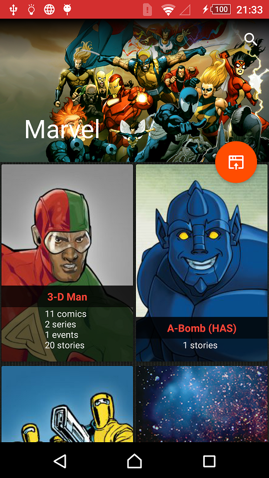
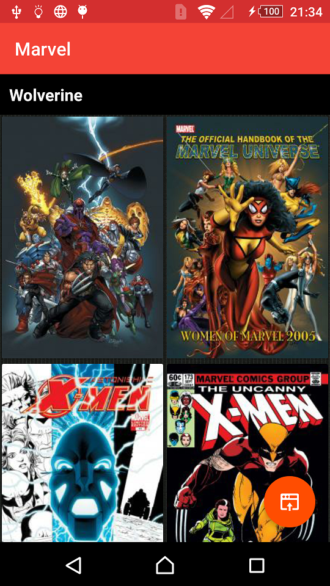

# Marvel

Marvel API use.

- The main Activity lists all the Marvel Heroes using pagination.
- You can search for your favorite Hero by name (using the `nameStartsWith` parameter that provides the API).
- Selecting a Hero you will be able to see a list with all his comics (if available from the API).
- Selecting from the comic list for a Hero you will see a description of it (if available from the API).
- You can also go from the main Activity to the Marvel's web page and from the Comics list Activity to the Hero's web page with an internal WebView.

## Design

The design just tries to be similar to the Marvel Web.

## Architecture

This application uses Clean Architecture with MVP.

## Info

Libraries:

- Picasso
- Butterknife
- RX
- Dagger 2
- Retrofit 2

Android Widgets:

- CoordinatorLayout
- AppBarLayout
- CollapsingToolbarLayout
- Toolbar
- FloatingActionButton
- SearchView
- SwipeRefreshLayout
- NestedScrollView
- NestedWebView
- RecyclerView
- ProgressBar

## Tests

Just some simple tests for cryptography and api keys.

## Screenshots

## License
    Copyright 2017 Esteban Latre
    
    Licensed under the Apache License, Version 2.0 (the "License");
    you may not use this file except in compliance with the License.
    You may obtain a copy of the License at
    
        http://www.apache.org/licenses/LICENSE-2.0
    
    Unless required by applicable law or agreed to in writing, software
    distributed under the License is distributed on an "AS IS" BASIS,
    WITHOUT WARRANTIES OR CONDITIONS OF ANY KIND, either express or implied.
    See the License for the specific language governing permissions and
    limitations under the License.
